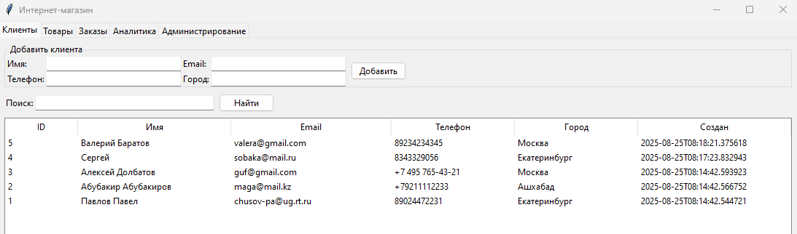
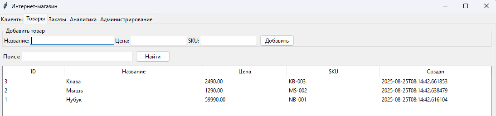
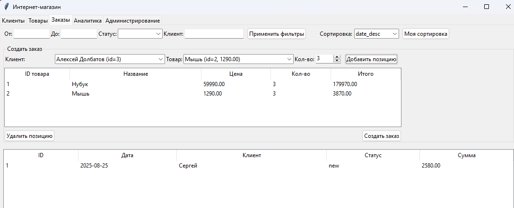
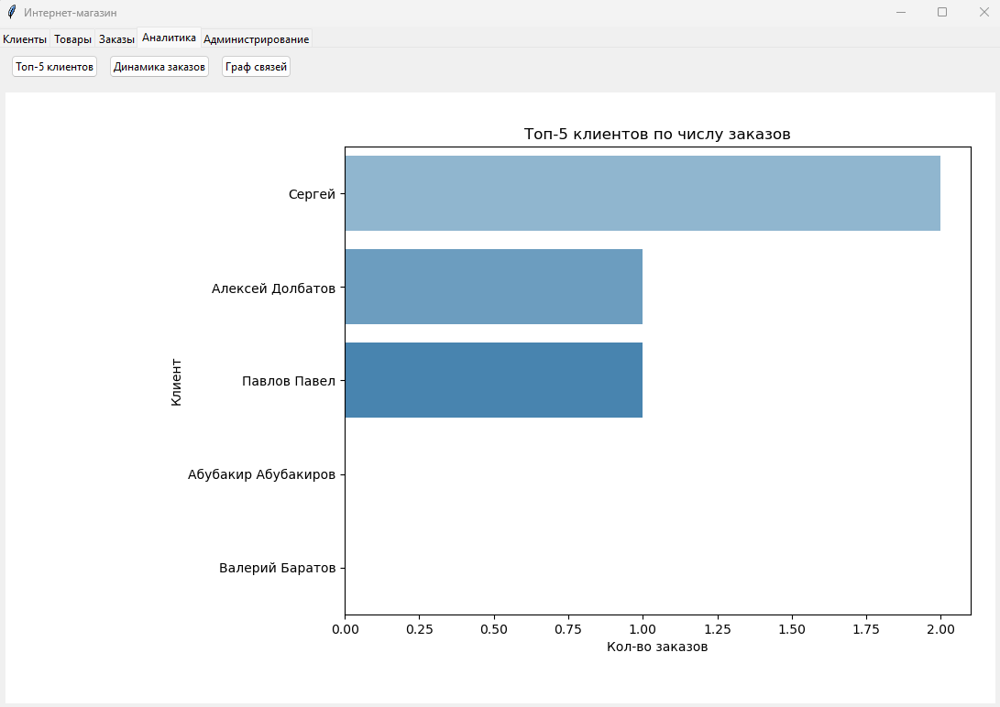
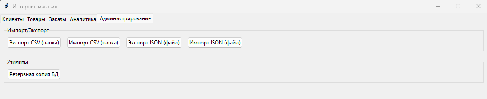

≡ Краткое руководство для проекта

#  
 Приложение для менеджеров интернет-магазина
## Описание проекта
Настольное приложение для менеджеров интернет-магазина.  
Позволяет:
- регистрировать клиентов и их контактные данные;
- добавлять заказы и связанные товары;
- просматривать, фильтровать, сортировать и анализировать заказы и клиентов;
- экспортировать и импортировать данные в/из различных форматов (CSV, JSON);
- визуализировать данные (динамика продаж, топовые товары и пр.);
- реализовать базовые инструменты администрирования через GUI (tkinter) или Flask. 
## Реализация
Проект реализован благодаря библиотекам:  
- tkinter (GUI, графический интерфейс)
- sqlite3 (SQLite, работа с базой данных)
- pandas (анализ и обработка данных)
- seaborn (построение графиков)
- matplotlib.pyplot (построение графиков)
- networkx (построение графов)
- re (проверка корректности введенных данных)
## Запуск
Импортировать проект, запустить main.py
## Работа в приложении  
### Регистрации клиентов  
- Регистрация клиентов
- Обработка корректности введенного номера телефона
- Обработка корректности введенного e-mail
- Актуальное отображение зарегистрированных клиентов
- Быстрый поиск клиентов по имени/e-mail/телефону/городу  

### Регистрация товаров
- Добавление нового товара в базу данных
- Быстрый поиск по имени/артикулу товара  

### Создание заказов
- Создание заказа с возможностью редактирования еще не созданного заказа
- Фильтрация товаров по дате
- Фильтрация по имени клиента
- Собсвенная сортировка по дате/имени, в том числе обратная

### Аналитика
- Диаграмма ТОП-5 клиентов по кол-ву заказов
- График динамики товаров (по дням)
- Граф связей клиентов по городу

### Администрирование
- Импорт/экспорт базы данных в/из .csv
- Импоре/эскпорт базы данных в/из .json
- Резервирование созданной базы данных

## Заключение
Данный проект является аттестационной работой по курсу "Разработка ПО (Python для начинающих специалистов)",  
И не является коммерческим продуктов. Написан для демонстрации полученных знаний.

